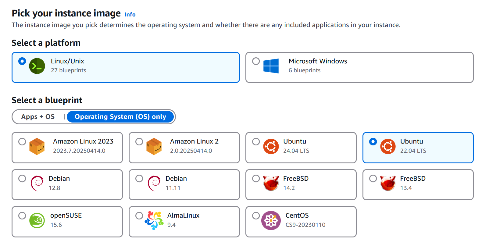
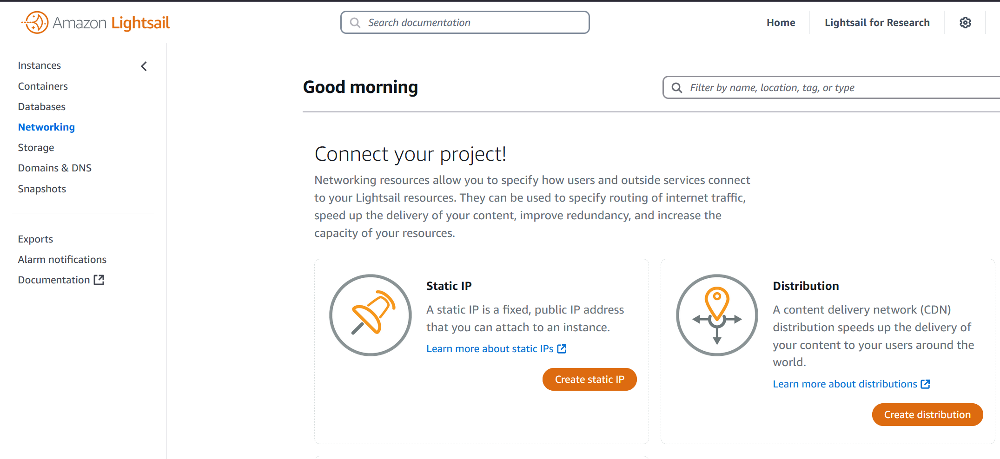
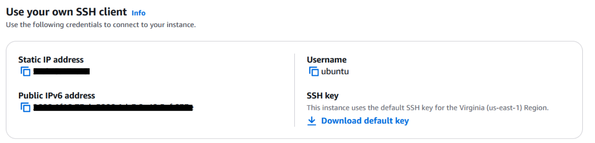

# Roversa Teacher Dashboard

## Table of Contents

1. [Overview](#overview)
2. [Setup](#setup)
3. [Dependencies](#dependencies)
   1. [System](#system)
   2. [Next app](#next-app)
   3. [MariaDB installation](#mariadb-installation)
4. [Database setup](#database-setup)
5. [Deploy locally](#deploy-locally)
6. [Deploy on AWS](#deploy-on-aws)
   1. [Server setup](#server-setup)
   2. [Deploy on server IP](#deploy-on-server-ip)
   3. [Keep the website running continously](#keep-the-website-running-continously)
7. [How to contribute](#how-to-contribute)
8. [Credits](#credits)
9. [License](#license)

<a name="overview"></a>

## Overview

Spring 2025 Synthesis Design (ENGR1420) Final Project

For Roversa Robotics (Eric Bredder and Kim Wilkens)

The Roversa Teacher Dashboard is a website that wirelessly connects to Roversa robots and allows real-time monitoring of student progress (via button presses and battery levels) and organization of robots, students, and classes.

**NOTE: The current website is NOT secure and NO legitimate information should be put into it! See the Technical Report for more specifics.**

<a name="setup"></a>

## Setup

Clone the repository: `git clone https://github.com/pigeons56/roversa-dashboard.git`

Go into project directory: `cd roversa-dashboard`

<a name="dependencies"></a>

## Dependencies

<a name="system"></a>

### System

I used Ubuntu 22.04. Generally, these steps can be done with any Linux distribution without much trouble. You can also use Windows, but make sure to install the Windows versions of dependencies. macOS has not been tested, but just make sure you install the macOS version of the dependencies and everything should work.

For Windows users, you can install the [Windows Subsystem for Linux (WSL)](https://learn.microsoft.com/en-us/windows/wsl/install) to run Ubuntu on your computer.

<a name="next-app"></a>

### Next app

Install node version manager (nvm): `wget -qO- https://raw.githubusercontent.com/nvm-sh/nvm/v0.40.2/install.sh | bash` (or install the latest version of nvm from [here](https://github.com/nvm-sh/nvm))

Start nvm:

```
export NVM_DIR="$HOME/.nvm"
[ -s "$NVM_DIR/nvm.sh" ] && \. "$NVM_DIR/nvm.sh"
[ -s "$NVM_DIR/bash_completion" ] && \. "$NVM_DIR/bash_completion"
```

Install node: `nvm install node`

Install project dependencies: `npm install`

<a name="mariadb-installation"></a>

### MariaDB installation

The database used was MariaDB installed locally.

Install mariadb: `sudo apt install mariadb-server mariadb-client`

Securely install: `sudo mariadb-secure-installation` Feel free to configure, or keep pressing ENTER until it asks for a new password.

Start mariadb: `sudo systemctl start mariadb`

<a name="database-setup"></a>

## Database setup

Use mariadb: `mariadb -u root -p` It will prompt you for the password you typed earlier.

Create the "dashboard" database: `CREATE DATABASE dashboard;`

Use the "dashboard" database: `USE dashboard;`

Create the "classes" table - the name of each class:

```sql
CREATE TABLE classes(
	className VARCHAR(16) NOT NULL,
	username VARCHAR(16) NOT NULL,
	PRIMARY KEY (className, username),
	FOREIGN KEY (username) REFERENCES users(username) ON DELETE CASCADE);
```

Create the "students" table - the identifying info of each student:

```sql
CREATE TABLE students(
	firstName VARCHAR(32) NOT NULL,
	lastName VARCHAR(32) NOT NULL,
	studentID INT NOT NULL,
	username VARCHAR(16) NOT NULL,
	PRIMARY KEY (studentID, username),
	FOREIGN KEY (username) REFERENCES users(username) ON DELETE CASCADE);
```

Create the "student_classes" table - which classes each student is in:

```sql
CREATE TABLE student_classes(
	studentID INT NOT NULL,
	className VARCHAR(16) NOT NULL,
	username VARCHAR(16) NOT NULL,
	PRIMARY KEY (studentID, className, username),
	FOREIGN KEY (studentID) REFERENCES students(studentID) ON DELETE CASCADE,
	FOREIGN KEY (className) REFERENCES classes(className) ON DELETE CASCADE,
	FOREIGN KEY (username) REFERENCES users(username) ON DELETE CASCADE);
```

Create the "robot_output" table - the data received from the ESP-32:

```sql
CREATE TABLE robot_output(
robotID INT NOT NULL,
program VARCHAR(300),
button VARCHAR(8),
battery DOUBLE,
datetime TIMESTAMP NOT NULL DEFAULT CURRENT_TIMESTAMP);
```

Create the "robots" table - the ID of each robot

```sql
CREATE TABLE robots(
	robotID INT NOT NULL,
	username VARCHAR(16) NOT NULL,
	PRIMARY KEY (robotID, username),
	FOREIGN KEY (username) REFERENCES users(username) ON DELETE CASCADE);
```

Create the "robots_classes" table - the classes each robot is assigned to

```sql
CREATE TABLE robots_classes(
	robotID INT NOT NULL,
	displayName VARCHAR(16) NOT NULL,
	className VARCHAR(16) NOT NULL,
	username VARCHAR(16) NOT NULL,
	PRIMARY KEY (robotID, className, displayName, username),
	FOREIGN KEY (robotID) references robots(robotID) ON DELETE CASCADE,
	FOREIGN KEY (className) REFERENCES classes(className) ON DELETE CASCADE,
	FOREIGN KEY (username) REFERENCES users(username) ON DELETE CASCADE);
```

Create the "student_robots" table - the robots each student is assigned to

```sql
CREATE TABLE student_robots (
	robotID INT NOT NULL,
	robotName VARCHAR(16) NOT NULL,
	studentID INT NOT NULL,
	className VARCHAR(16) NOT NULL,
	username VARCHAR(16) NOT NULL,
	PRIMARY KEY (robotID, robotName, studentID, className, username),
FOREIGN KEY (robotID) REFERENCES robots(robotID) ON DELETE CASCADE,
	FOREIGN KEY (studentID) REFERENCES students(studentID) ON DELETE CASCADE,
	FOREIGN KEY (className) REFERENCES classes(className) ON DELETE CASCADE,
	FOREIGN KEY (username) REFERENCES users(username) ON DELETE CASCADE);
```

You can exit out of MariaDB with CTRL-Z.

<a name="deploy-locally"></a>

## Deploy locally

Make sure you're in the project directory: `cd roversa-dashboard`

Run in development mode: `npm run dev`

Or... build the app: `npm run build` (this may take a while)

And start the built app: `npm run start`

To see the website, go to localhost:3000 in your browser.

<a name="deploy-on-aws"></a>

## Deploy on AWS

I recommend doing any development/testing locally, saving it to a Github repo, then pulling that onto the server. Developing on the server can be very slow.

**Note: you need to reinstall all the dependencies on the server.**

<a name="server-setup"></a>

### Server setup

I used a free AWS account and Amazon Lightsail.

Create a Lightsail Instance on Ubuntu 22.04.



Name the instance whatever you want.

Once you create the instance, go to "Networking" in the left sidebar, then create a static IP and attach the instance you just created.



This is the IP of your server. At this point, if you're using this website with the Roversa Hub, edit the ESP-32 code to connect to this IP address.

To connect to the server, you can use the console AWS provides on the browser or SSH into the server from your computer (recommended).

To SSH into the server, you need to download the default SSH key of the server. Click into the instance and scroll down to "Use your own SSH client".



Then, into the command line of your computer: `ssh -i <LightsailDefaultKey.pem> ubuntu@<staticip>` Replace LightsailDefaultKey.pem with the file of the key you just downloaded and staticip with whatever your static IP is.

If you did everything correctly, your command line will welcome you to Ubuntu 22.04 and now show that you are in ubuntu@ip-staticip.

Allocate 2GB to swap space: `sudo fallocate -l 2G /swapfile && sudo chmod 600 /swapfile && sudo mkswap /swapfile && sudo swapon /swapfile && sudo sed -i '$ a\/swapfile swap swap defaults 0 0' /etc/fstab` This is not necessary, but could reduce crashes.

Clone the repo on the server: `git clone https://github.com/pigeons56/roversa-dashboard.git`

Make sure you're in the project directory: `cd roversa-dashboard`

<a name="deploy-on-server-ip"></a>

### Deploy on server IP

We need a reverse proxy service to redirect server traffic from localhost:3000 (default) to HTTP:80 (connectable from the server IP). I used NGINX.

Install NGINX: `sudo apt-get install -y nginx`

Edit NGINX config: `sudo nano /etc/nginx/sites-available/default`

Replace the config file:

> Nano shortcuts:
>
> CTRL+SHIFT+6 to start highlighting, then scroll to bottom
>
> CTRL+K to delete
>
> Copy the text below
>
> RIGHT CLICK to paste
>
> CTRL+X to exit
>
> Y to save
>
> ENTER to confirm

```
server {
	listen 80;
	location / {
		proxy_pass http://localhost:3000;
		proxy_http_version 1.1;
		proxy_set_header Upgrade $http_upgrade;
		proxy_set_header Connection 'upgrade';
		proxy_set_header Host $host;
		proxy_cache_bypass $http_upgrade;
	}
}
```

Check if config file saved: `sudo cat /etc/nginx/sites-available/default`

Check if config changes were a success: `sudo nginx -t`

Restart NGINX: `sudo systemctl restart nginx`

Now check your IP in your browser - you should receive a "502 Bad Gateway" from NGINX.

Then, app deployment is the same as deploying locally.

Run in development mode: `npm run dev`

Or build the app: `npm run build`

Start the built app: `npm run start`

Instead of going to localhost:3000 in your browser, go to your IP address.

<a name="keep-the-website-running-continously"></a>

### Keep the website running continously

Currently, the website closes the moment the terminal on the server closes. To keep it running continously, use PM2.

Install PM2: `npm install -g pm2`

Build your app if you haven't yet: `npm run build`

Start your server with pm2: `pm2 start npm --  start`

<a name="how-to-contribute"></a>

## How to contribute

To best contribute, please read the Technical Report for the exact structure of the project, and see NextJS tutorials on how to work with a Next app.

Feel free to fork, open issues, or contact Michelle Hu (cka2jr@virginia.edu) for contributor access.

<a name="credits"></a>

## Credits

By: Michelle Hu

Team: Michelle Hu, Anastasia Adams-Giron, Jayrady Sok,
Joshua Castillo-Cruz, Christopher Lim

Advised by: Reid Bailey and Shaadaan Burn

For inquiries, contact Michelle Hu (cka2jr@virgina.edu) or open an issue.

<a name="license"></a>

## License

The Roversa Teacher Dashboard is available under the MIT license. See the LICENSE file for more info.
